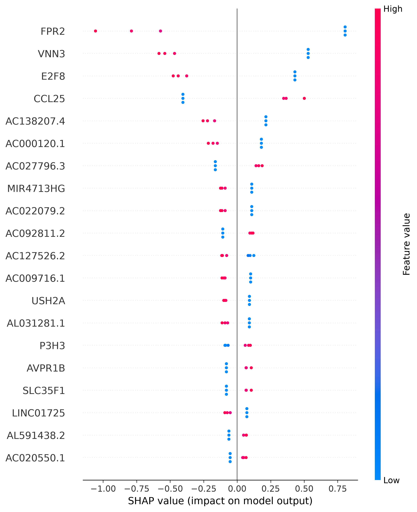
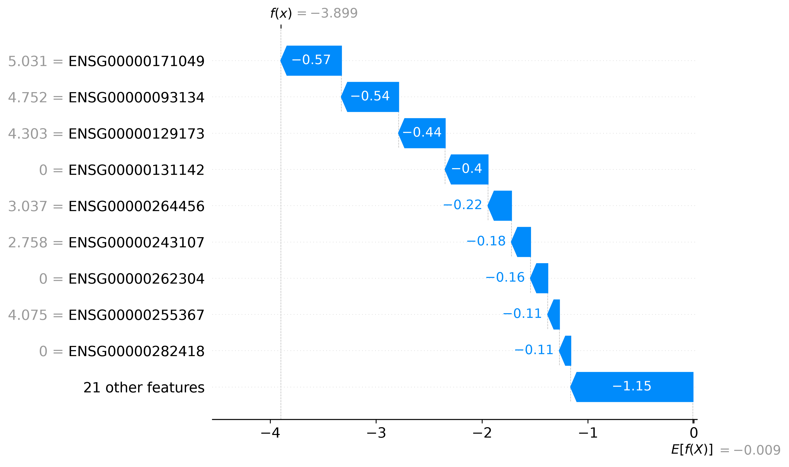

# PCOS Transcriptomics with Explainable AI

## Problem

Polycystic Ovary Syndrome (PCOS) is a common endocrine condition with a documented but incompletely understood transcriptional signature. This project asks a narrower, methodological question rather than a purely biological one: when a machine learning classifier is trained to distinguish PCOS from control samples using gene expression data, can its internal reasoning (which genes it relies on, and why) be trusted as genuine biological insight, or does it need to be critically evaluated against the model's actual validated performance and against independent biological databases?

Explainability tools like SHAP are increasingly used in health-adjacent machine learning, but a model's explanation is not automatically evidence that the model is correct. This project demonstrates the judgment required to tell the difference.

## Approach

### 1. Dataset

[GSE138518](https://www.ncbi.nlm.nih.gov/geo/query/acc.cgi?acc=GSE138518) from NCBI GEO, a true bulk RNA-seq (not single-cell), comprising granulosa cell samples from 3 PCOS patients and 3 control patients undergoing IVF. Raw counts were provided directly as an Excel workbook, requiring no pseudobulk aggregation.

### 2. Normalization

Raw counts were loaded in R and normalized using DESeq2's size-factor correction, then log2-transformed, following the same approach used in this portfolio's earlier [Acne Transcriptomics Differential Expression Analysis](https://github.com/Adeola29-star/acne-transcriptomics-differential-gene-expression-analysis) project.

### 3. Classification

A logistic regression classifier was trained to distinguish PCOS from control samples, using the same model type as this portfolio's [AI-Augmented Acne Transcriptomics Pipeline](https://github.com/Adeola29-star/ai-augumented-acne-transcriptomics-pipeline) project for consistency.

**A leak-free pipeline was built from the outset.** Feature selection (`SelectKBest`, top 30 genes by ANOVA F-test) and classification were combined into a single scikit-learn `Pipeline`. This ensures that gene selection was performed independently within each Leave-One-Out Cross-Validation (LOOCV) fold, using only that fold's training samples, avoiding a data leakage issue identified and corrected in this portfolio's earlier classifier project.

### 4. SHAP analysis

SHAP's `LinearExplainer` was applied to a final logistic regression model (refit on all 6 samples) to identify which genes most influenced its predictions, both overall (summary plot) and for an individual sample (waterfall plot).

### 5. Cross-checking against protein interaction databases

The named, literature-recognized genes identified by SHAP were checked against both **STRING** and **NetworkAnalyst** for documented or predicted protein-protein interactions, to assess whether the model's reasoning reflects a coordinated biological pathway or isolated, potentially coincidental associations.

## Results

### Classifier performance

LOOCV produced **0/6 correct predictions (0% accuracy)**. Examining predicted class probabilities confirmed this was not simple near-50/50 guessing: several predictions were wrong with high confidence (82-90%), consistent with the classifier finding spurious, non-generalizable patterns in an extremely high-dimensional, low-sample dataset (33,289 candidate genes against only 5 training samples per fold).

### SHAP summary plot



The top-ranked genes were **FPR2**, **VNN3**, and **CCL25** - all three with genuine, literature-supported relevance to inflammation and oxidative stress, both established PCOS-associated mechanisms. Direction was explicitly verified against the model's raw decision function: higher expression of each gene pushed predictions toward PCOS. The majority of the remaining 27 selected genes were uncharacterized long non-coding RNAs or ESTs with no established function, consistent with overfitting rather than genuine signal.

### Individual-sample SHAP explanation



Sample P16 (a true PCOS sample) was explained confidently and correctly by the final model (fit on all 6 samples). However, this same sample was one of the LOOCV-evaluated model's most confidently *wrong* predictions when genuinely held out during training. This contrast is discussed in the Conclusion.

### Protein-protein interaction cross-check

Both **STRING** (0 observed interactions, 0 expected, p = 1) and **NetworkAnalyst** (no network found) independently found **no documented or predicted interactions** among the 8 named genes identified by SHAP (FPR2, VNN3, E2F8, CCL25, USH2A, P3H3, AVPR1B, SLC35F1).


## Limitations

**1. Extremely small sample size (n = 6).** With only 3 PCOS and 3 control samples, this dataset cannot support a reliable classifier, as demonstrated by the 0% LOOCV accuracy. Results should be read as a methodological demonstration, not a validated biological finding.

**2. High dimensionality relative to sample size.** 33,289 candidate genes against 5 training samples per fold creates conditions highly prone to spurious, non-generalizable feature selection.

**3. SHAP explains the final model, not a validated one.** The SHAP analysis was performed on a model refit on all 6 samples, which had already seen every sample it was later used to explain, including the individual sample highlighted in the waterfall plot. This is standard practice for generating SHAP explanations, but it means these explanations describe how the final model rationalizes known data, not a claim about how it would behave on genuinely unseen samples.

**4. No validated interacting network among top genes.** Despite individual biological plausibility, the SHAP-identified genes showed no documented protein-protein interactions in either of two independent databases (STRING, NetworkAnalyst), so they cannot be described as a confirmed coordinated pathway.

## Conclusion

See [`CONCLUSION.md`](CONCLUSION.md) for the full one-page judgment on whether this model's reasoning is biologically credible.

## Tools and Technologies

R, DESeq2, STRINGdb, Python, pandas, scikit-learn, SHAP, NCBI GEO, STRING, NetworkAnalyst

## Project Outputs

- `pcos_analysis.R` - R script: data loading, DESeq2 normalization, STRING cross-check
- `pcos_shap_classifier.ipynb` - Python notebook: classifier, LOOCV evaluation, SHAP analysis and plots
- `CONCLUSION.md` - one-page conclusion on the model's biological credibility
- `shap_summary_plot.png` - SHAP summary plot across all samples
- `shap_waterfall_P16.png` - individual-sample SHAP explanation
- `networkanalyst_no_results.png` - NetworkAnalyst cross-check result

## Repository Structure

```
pcos-transcriptomics-shap-explainable-ai/
│
├── README.md
├── CONCLUSION.md
├── pcos_analysis.R
├── pcos_shap_classifier.ipynb
│
├── shap_summary_plot.png
├── shap_waterfall_P16.png
└── networkanalyst_no_result.png
```

Raw GEO data are not included in the repository. The dataset can be obtained from NCBI GEO using accession GSE138518.
